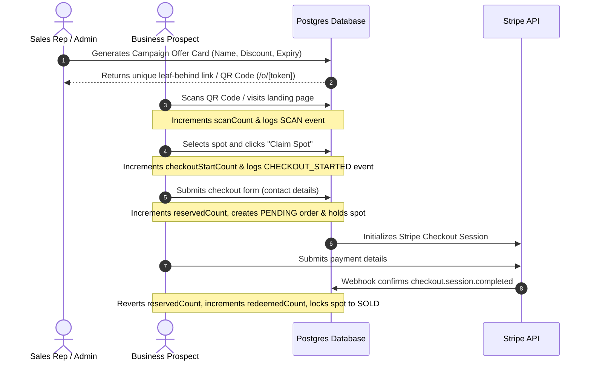

# Instructional Guide - In-Person Campaign Offer Cards

This guide outlines how the **Campaign Offer Cards** feature works and provides step-by-step instructions to verify the entire flow manually on a running instance of NearHere without executing automated database seed scripts.

---

## 1. Feature Architecture Overview

The Campaign Offer Cards flow coordinates administrative discount generation with end-user checkout attribution:

---

## 2. Step-by-Step Manual Verification Instructions

Follow these instructions to test the campaign offer flow from admin creation to end-user ad copy submission.

### Phase A: Admin Offer Creation
1. Start your local development server (e.g., `npm run dev`) if it is not already running.
2. Open your web browser and navigate to the Admin Dashboard (typically at `http://localhost:3000/admin`).
3. Click on the **Campaigns** section and select any campaign (or create a new one).
4. On the campaign detail page, navigate to the **Offers** tab.
5. In the **Generate New Campaign Offer Card** form, enter the following details:
   - **Offer Name**: `Local Rep Launch Special`
   - **Discount Type**: `Amount Off ($)`
   - **Discount Amount**: `100.00`
   - **Max Redemptions**: `5`
   - **Expiration Date**: (Select a future date, or leave blank)
   - **Notes**: `Test card for manual verification`
6. Click **Create Offer & Token**.
7. Confirm that the new offer appears in the **Existing Campaign Offer Cards** table with:
   - Correct discount value (`$100.00`)
   - Initial stats at zero (`0` scans, `0` starts, `0` reserved, `0` paid)
   - A generated mini QR code preview

### Phase B: Print Cards (Flyer Card)
1. In the **Existing Campaign Offer Cards** table, locate your new offer.
2. Click **Print Card**. This opens the print flyer view at `/admin/campaigns/[campaignId]/offers/[offerId]/print` in a new tab.
3. Verify that the printable flyer:
   - Shows the promotion name (`Local Rep Launch Special`) and discount value (`$100.00 OFF`)
   - Displays a large QR code pointing to `/o/[token]`
   - Exposes attribution details correctly (promoted by the logged-in admin rep, target campaign location)
   - Hides control buttons when printing (use your browser's Print Preview / `Ctrl+P` to confirm).

### Phase C: Prospect Claims Offer & Checkouts
1. Go back to the **Offers** tab in the admin table and click **Copy Link**.
2. Open an **Incognito / Private Window** (to simulate a prospect scanning the card on their phone).
3. Paste the copied URL (e.g., `http://localhost:3000/o/[token]`) and navigate to it.
4. Verify the landing page:
   - Displays "Your NearHere rep: [Admin Name]" (masking the email address)
   - Renders a promo card showing `$100.00 off`
   - Lists all **Available Postcard Placements** in the campaign
5. Choose any spot in the list and click **Select & Checkout**.
6. On the Checkout page, confirm the following UI items:
   - A green banner at the top shows: *"Special Promotion Applied - In-person business discount applied. Promoted by: [Admin Name]"*.
   - The **Spot Summary** column displays the price breakdown:
     - *Original Price*: Full spot price (e.g., `$490.00`)
     - *Discount*: `-$100.00`
     - *Total Price*: Discounted price (e.g., `$390.00`)
     - *Promoted by* attribution badge.
7. Fill out the business contact form and submit. This will redirect you to Stripe Checkout.
8. If Stripe sandbox is configured, you will see a Stripe Checkout page showing the discounted total price. 
9. *(Optional)* Complete payment in Stripe test mode.

### Phase D: Verify Attribution Metrics
1. Go back to your main browser tab logged in as Admin.
2. Refresh the campaign details page and select the **Offers** tab.
3. Examine the stats for your offer in the table:
   - **Scans** should be `1`
   - **Starts** should be `1`
   - **Reserved** should be `1` (if you completed step 7 but did not pay) OR **Paid** should be `1` (if you paid).

---

## 3. Post-Payment & Creative Ad Copy Flow

Once payment goes through, the merchant is redirected to submit their creative copy:

1. Locate the confirmation email link sent to the merchant (or retrieve the `creativeSubmissionToken` from the order row in the database).
2. Go to `http://localhost:3000/creative/submit?token=[creativeSubmissionToken]`.
3. Submit the business logo, ad headline, discount copy, and designer notes.
4. Go back to the Admin Dashboard, navigate to the **Creative** tab on the campaign detail page, and approve the submission.
5. Confirm that the merchant can no longer edit print-sensitive creative properties.
